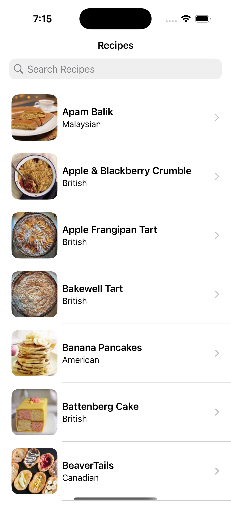
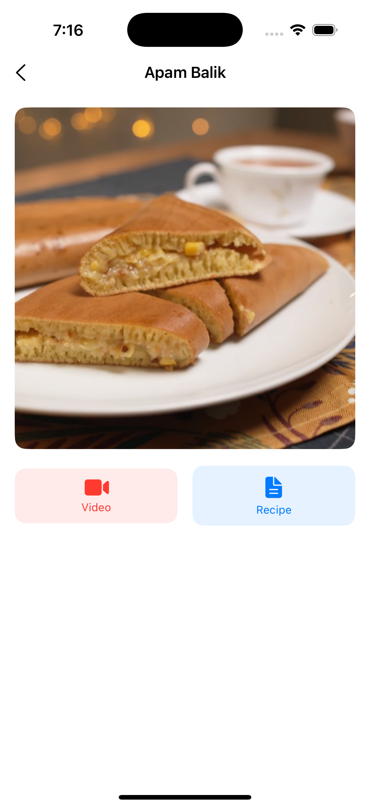
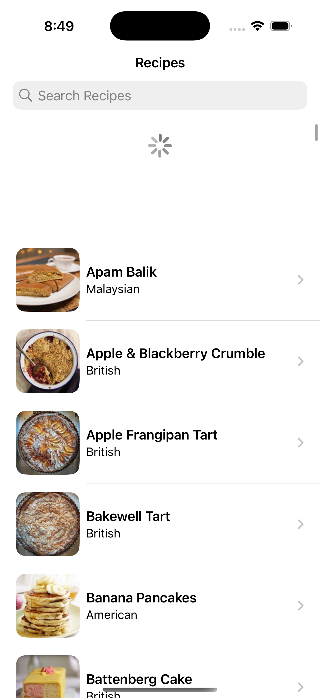
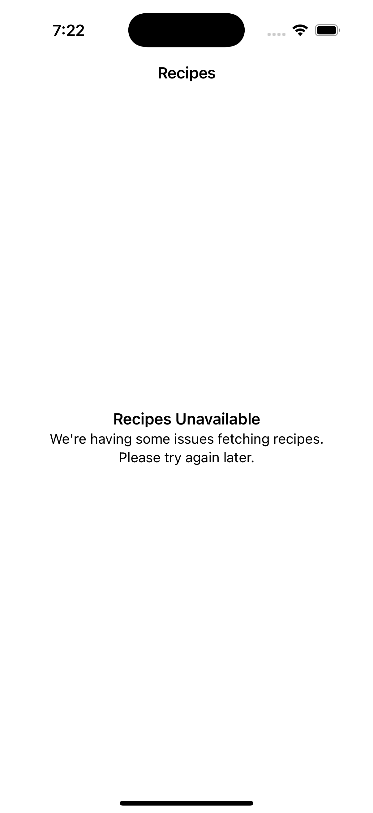
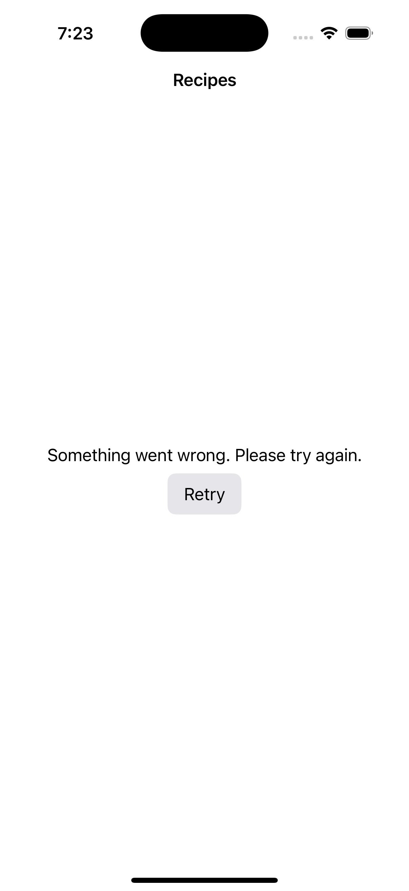
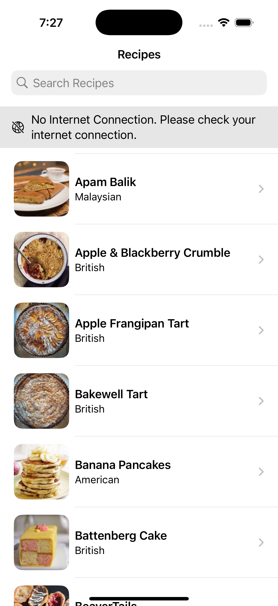
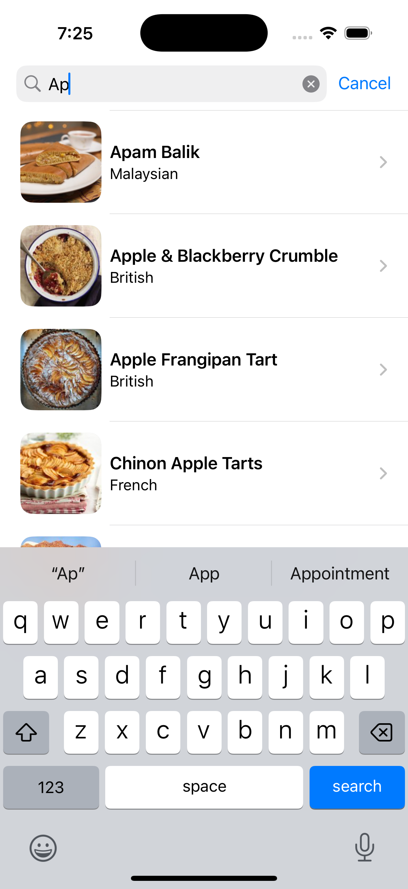
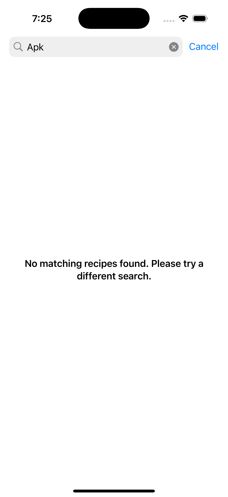

### Summary: App Features & Screenshots

The Recipe Fetch app allows users to browse a list of delicious recipes sourced from the provided API. Each recipe entry displays its name, cuisine type, and a thumbnail image. The app supports refreshing the recipe list and handles different states gracefully, such as loading, empty data, network errors, and no internet connectivity.

Here's a quick look at the main features:

1.  **Recipe List View:** The primary screen displaying recipes with their name, cuisine, and thumbnail. It also has search bar.

2.  **Recipe Detail View:** The detail screen displaying recipe with the name in navigation bar. It has cover image and quick action buttons like link to video of recipe and text of recipe.

 3.  **Pull-to-Refresh:** Users can easily update the recipe list.

4.  **Empty State:** A clear message when no recipes are available (if the API returns an empty list).

5.  **Error State:** Handles API errors gracefully and informs the user.

6.  **No Internet Connection State:** Detects and informs the user if there's no network connectivity.

7.  **Search Recipe With List:** Contains the filtered list.

8.  **Search Recipe With Empty List**

---

### Focus Areas

Given the project requirements, I prioritized the following areas:

1.  **Custom Image Caching (Disk-based):** The requirement to build a custom disk cache without relying on `URLCache` or third-party libraries was a key focus. I implemented an `ImageCacheManager` actor to handle fetching images, storing them to a dedicated directory in the app's Caches folder, and retrieving them. This was important for understanding low-level resource management and efficient network usage.
2.  **Swift Concurrency (`async/await`):** I made sure all asynchronous operations, particularly network calls for recipes and images, leveraged modern Swift Concurrency. This makes the code cleaner, more readable, and helps manage complex asynchronous flows effectively. The `ImageCacheManager`, `NetworkManager` and `RecipeListViewModel` heavily utilize `async/await`.
3.  **Networking Layer:** I established a clean separation for network operations with an `Endpoint` definition, a generic `NetworkManager` for making requests, and a specific `RecipeAPI` service. Error handling was a priority here to ensure the UI could respond appropriately to different network conditions.
4.  **SwiftUI and MVVM-like Architecture:** The UI is built entirely with SwiftUI, as requested. I adopted an MVVM-like pattern (`RecipeListViewModel` driving the `RecipesList` view) to ensure a good separation of concerns, making the UI reactive and the business logic testable. State management for loading, error, and content display was central to the ViewModel's design.
5.  **Unit Testing Core Logic:** I focused on unit testing the `ImageCacheManager` (to validate the custom caching logic) and Mocking dependencies like `URLSession` (via `MockURLProtocol`) and `RecipeAPI` was key to creating isolated and reliable tests.

I chose these areas because they directly addressed the core technical requirements of the exercise and represent common challenges in iOS development. Building the custom cache was particularly interesting as it's not something one does every day when `URLCache` or libraries like Kingfisher/Nuke are available.

---

### Time Spent

*   **Total Approximately:**  9-10 hours
*   **Allocation:**
    *   **Project Setup & Initial Structure:** ~1 hour (Understanding requirements, setting up folder structure, basic app shell)
    *   **Networking Layer:** ~1.5-2 hours
    *  **No internet connection:** ~0.5-1 hour
    *   **Custom `ImageCacheManager` (Disk Cache & Async Loading):** ~2.5-3 hours (This was the most involved due to the "no dependencies" rule and careful file management)
    *   **ViewModel & SwiftUI Views:** ~1.5-2 hours (Implementing states, list, cell, refresh, detail, error state and empty state)
    *   **Unit Testing:** ~1.5-2 hours (Writing tests, mocking)
    *   **Refinement, README, and Final Review:** ~1.5-2 hours

---

### Trade-offs and Decisions

*   **In-Memory Image Cache:** The requirement was specifically for a *disk cache*. While an additional in-memory cache would further optimize image loading for very recently accessed images, I decided to stick strictly to the disk cache requirement to demonstrate that core functionality first. Adding an in-memory layer would be a natural next step for performance enhancement.
*   **Simplicity of Network Error Mapping:** For the `RecipeAPI`, I kept the error mapping from lower-level network issues to `NetworkError` relatively straightforward. In a larger production app, this mapping might be more nuanced.

---

### Weakest Part of the Project

If I had more time, the area I'd focus on improving is:

*   **Custom Disk Cache:** The current `ImageCacheManager` implements a basic disk cache by writing data to files. It doesn't include features like Cache Size Management/Eviction Policy and Background Expiry/Validation.

    This was a conscious trade-off to meet the deadline and focus on the core requirement of "cache to disk," but these are important considerations for a production-grade cache.
    
*   **Test Coverage for Edge Cases:** While I've included unit tests for the core logic of `ImageCacheManager` (like loading from network/disk, basic error handling) and `NetworkManager` (data fetching), the test coverage could be expanded. Specifically: 
    * **More Granular Error Condition Tests:** For instance, testing the `ImageCacheManager` against a wider variety of simulated disk I/O failures. 
    *  **Concurrency Stress Testing (for `ImageCacheManager`):** Although the `ImageCacheManager` is an actor, more rigorous testing under high concurrency  could further validate its robustness. This is often complex to set up in unit tests but is valuable. 

    The current tests cover the primary success paths and common failure modes, which I prioritized to demonstrate the testing approach.

---

### Additional Information

*   **Constraint: No External Dependencies:** This was a fun challenge! It really makes you appreciate the convenience of libraries like Alamofire or Kingfisher, but also provides a great opportunity to work with Apple's native frameworks like `URLSession` and `FileManager` at a deeper level.
*   **Swift Testing Framework:** I used the new Swift Testing framework (`import Testing`) for unit tests, as it's the modern approach Apple is encouraging.
*   **Actor Usage:** I utilized an `actor` for `ImageCacheManager` and `NetworkManager` to ensure thread-safe access. Similarly, `RecipeListViewModel` is marked with `@MainActor` to ensure UI updates are always performed on the main thread.

Thank you for the opportunity to work on this exercise. I enjoyed tackling the requirements and look forward to discussing my approach!
